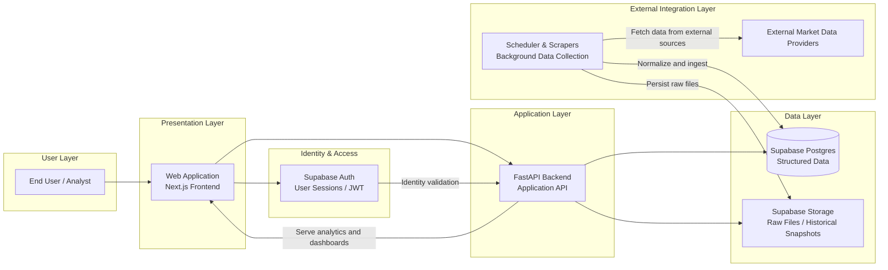

# Energy Market Predictor

A full-stack application for collecting, storing, and visualizing energy market data from public market sources.

## Overview

This project ingests energy market data from external providers, stores normalized data in a relational database, and exposes dashboard-ready APIs to a web frontend.

The system is composed of:

- a Next.js frontend for user interaction
- a FastAPI backend for application logic and API endpoints
- scheduled Python jobs for automated data collection
- Supabase Postgres for structured data storage
- Supabase Storage for raw files and historical snapshots

## Architecture

The application follows a layered architecture:

- Frontend: user interface and dashboard experience
- Backend: business logic, API, and data access
- Scheduler: automated ingestion jobs
- Data sources: external energy market providers
- Data storage: relational database and file storage



## Tech Stack

- Frontend: Next.js
- Backend: FastAPI
- Scheduler: Python + APScheduler
- Database: Supabase Postgres
- Storage: Supabase Storage
- Authentication: Supabase Auth

## Repository Structure

```text
energy-market-predictor/
├── backend/
│   ├── api/
│   ├── db/
│   ├── scraper/
│   ├── scheduler/
│   ├── main.py
│   ├── pyproject.toml
│   └── .env.example
├── frontend/
│   ├── src/
│   ├── public/
│   ├── package.json
│   └── .env.local.example
├── supabase/
│   ├── migrations/
│   └── config.toml
├── docs/
├── README.md
└── .gitignore